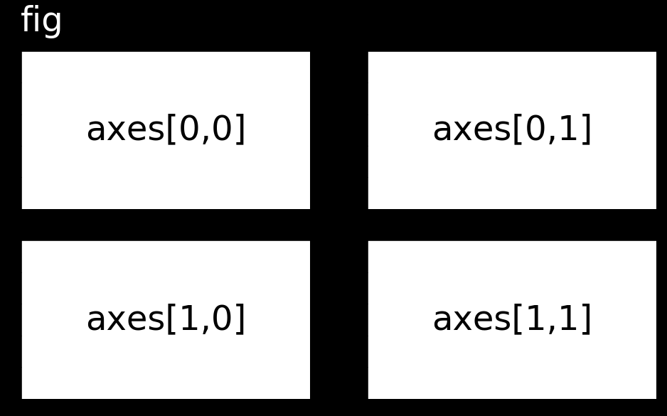

# Generate subplots

Generate subplots
You can draw multiple images in one figure to explore data quickly. Use plt.subplots() to generate an array of subplots.

fig, axes = plt.subplots(nrows=2, ncols=2)



To draw an image on a subplot, call the plotting method directly from the subplot object rather than through PyPlot: axes[0,0].imshow(im) rather than plt.imshow(im).

For this exercise, draw im1 and im2 on separate subplots within the same figure.

Instructions
100 XP
Create a subplots grid where nrows=2 and ncols=1.
Draw im1 and im2 on the first and second subplots respectively. Use a "gray" colormap for each.
For each subplot, turn off the axis ticks and labels.
Render the figure.

Here's how you can create a subplots grid with 2 rows and 1 column, draw the images `im1` and `im2` on the respective subplots, and turn off the axis ticks and labels:

```python
# Import PyPlot
import matplotlib.pyplot as plt

# Initialize figure and axes grid
fig, axes = plt.subplots(nrows=2, ncols=1, figsize=(8, 10))

# Draw an image on each subplot
axes[0].imshow(im1, cmap="gray")
axes[1].imshow(im2, cmap="gray")

# Remove ticks/labels and render
axes[0].axis('off')
axes[1].axis('off')

# Render the figure
plt.show()
```

### Explanation:
1. `plt.subplots(nrows=2, ncols=1, figsize=(8, 10))`: Creates a grid of subplots with 2 rows and 1 column. The `figsize` parameter adjusts the size of the figure.
2. `axes[0].imshow(im1, cmap="gray")`: Displays `im1` in the first subplot using the grayscale colormap.
3. `axes[1].imshow(im2, cmap="gray")`: Displays `im2` in the second subplot using the grayscale colormap.
4. `axes[i].axis('off')`: This turns off the axis ticks and labels for both subplots.
5. `plt.show()`: Renders the figure with the subplots displayed.