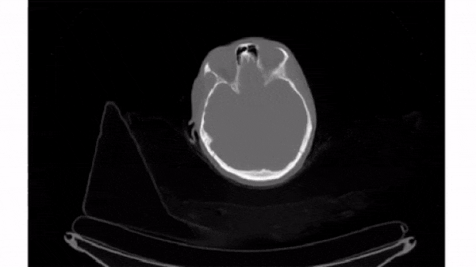

# Slice 3D images

Slice 3D images
The simplest way to plot 3D and 4D images by slicing them into many 2D frames. Plotting many slices sequentially can create a "fly-through" effect that helps you understand the image as a whole.



To select a 2D frame, pick a frame for the first axis and select all data from the remaining two: vol[0, :, :]

For this exercise, use for loop to plot every 40th slice of vol on a separate subplot. matplotlib.pyplot (as plt) has been imported for you.

Instructions
100 XP
Using plt.subplots(), initialize a subplots grid with 1 row and 4 columns.
Plot every 40th slice of vol in grayscale. To get the appropriate index, multiply ii by 40.
Turn off the ticks, labels, and frame for each subplot.
Render the figure.

Using plt.subplots(), initialize a subplots grid with 1 row and 4 columns.
Plot every 40th slice of vol in grayscale. To get the appropriate index, multiply ii by 40.
Turn off the ticks, labels, and frame for each subplot.
Render the figure.

py
# Plot the images on a subplots array 
fig, axes = ____

# Loop through subplots and draw image
for ii in range(4):
    im = ____
    axes[ii].imshow(____, cmap='gray')
    axes[ii].axis(____)
    
# Render the figure
plt.show()

Here's how you can set up a subplot grid with 1 row and 4 columns, plotting every 40th slice of the volume `vol` in grayscale:

```python
# Plot the images on a subplots array 
fig, axes = plt.subplots(1, 4, figsize=(16, 4))

# Loop through subplots and draw image
for ii in range(4):
    im = vol[ii * 40]  # Get every 40th slice
    axes[ii].imshow(im, cmap='gray')
    axes[ii].axis('off')  # Turn off ticks, labels, and frame
    
# Render the figure
plt.show()
```

### Explanation:
1. `plt.subplots(1, 4, figsize=(16, 4))`: Initializes a grid of subplots with 1 row and 4 columns, and sets the figure size.
2. `for ii in range(4)`: Loops over the range to plot 4 subplots.
3. `im = vol[ii * 40]`: Retrieves every 40th slice from the volume.
4. `axes[ii].imshow(im, cmap='gray')`: Displays the image in grayscale on the corresponding subplot.
5. `axes[ii].axis('off')`: Turns off the ticks, labels, and frame for each subplot.
6. `plt.show()`: Renders the figure with all the plotted subplots.