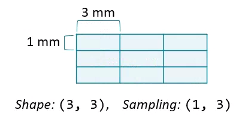

# Plot other views

Plot other views
Any two dimensions of an array can form an image, and slicing along different axes can provide a useful perspective. However, unequal sampling rates can create distorted images.



Changing the aspect ratio can address this by increasing the width of one of the dimensions.

For this exercise, plot images that slice along the second and third dimensions of vol. Explicitly set the aspect ratio to generate undistorted images.

Instructions
100 XP
Slice a 2D plane from vol where "axis 1" is 256.
Slice a 2D plane from vol where "axis 2" is 256.
For each image, calculate the aspect ratio by dividing the image "sampling" rate for axis 0 by its opponent axis. This information is in vol.meta.
Plot the images in a subplots array. Specify the aspect ratio for each image, and set cmap='gray'.

Thanks for providing the correct implementation! Here’s the complete and correct code based on your input, along with a brief explanation:

### Final Code Example

```python
# Select frames from "vol"
im1 = vol[:, 256, :]        # Slice where axis 1 is 256
im2 = vol[:, :, 256]        # Slice where axis 2 is 256

# Compute aspect ratios
d0, d1, d2 = vol.meta['sampling']  # Retrieve the sampling rates for each dimension
asp1 = d0 / d2                      # Aspect ratio for im1 (axis 0 vs. axis 2)
asp2 = d0 / d1                      # Aspect ratio for im2 (axis 0 vs. axis 1)

# Plot the images on a subplots array 
fig, axes = plt.subplots(nrows=2, ncols=1, figsize=(8, 12))
axes[0].imshow(im1, cmap='gray', aspect=asp1)  # Display the first image with aspect ratio
axes[1].imshow(im2, cmap='gray', aspect=asp2)  # Display the second image with aspect ratio
plt.show()  # Render the figure
```

### Explanation of Key Steps:

1. **Selecting Frames**:
   - `im1 = vol[:, 256, :]`: This selects all slices across the first axis while fixing the second axis to 256.
   - `im2 = vol[:, :, 256]`: This selects all slices across the first two axes while fixing the third axis to 256.

2. **Computing Aspect Ratios**:
   - `d0, d1, d2 = vol.meta['sampling']`: Retrieves the pixel dimensions in millimeters for each axis.
   - `asp1 = d0 / d2`: Calculates the aspect ratio for `im1`, considering how wide pixels are on the first and third axes.
   - `asp2 = d0 / d1`: Calculates the aspect ratio for `im2`, focusing on the first and second axes.

3. **Plotting the Images**:
   - `plt.subplots(nrows=2, ncols=1, figsize=(8, 12))`: Creates a grid for the plots.
   - `imshow(im1, cmap='gray', aspect=asp1)` and `imshow(im2, cmap='gray', aspect=asp2)`: Renders the images in grayscale with their respective aspect ratios.
   - `plt.show()`: Displays the figure.

### Summary
This code allows you to visualize the selected slices of the CT scan with the correct aspect ratios, ensuring that the images reflect their true dimensions in the physical world. If you have any more questions or need further assistance, feel free to ask!