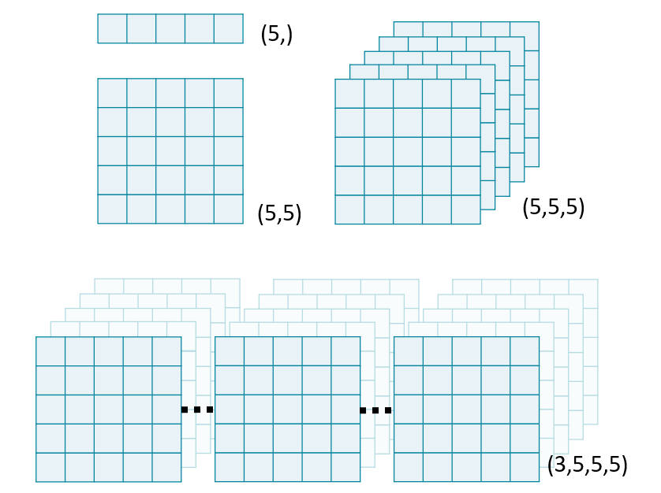

# Stack images

Stack images
Image "stacks" are a useful metaphor for understanding multi-dimensional data. Each higher dimension is a stack of lower dimensional arrays.



In this exercise, we will use NumPy's stack() function to combine several 2D arrays into a 3D volume. By convention, volumetric data should be stacked along the first dimension: vol[plane, row, col].

Note: performing any operations on an ImageIO Image object will convert it to a numpy.ndarray, stripping its metadata.

Import imageio and numpy (as np).
Load "chest-220.dcm", "chest-221.dcm", and "chest-222.dcm".
Create a 3D volume using np.stack(). Set the stacking axis to 0.
Print the shape attribute of vol.

# Import ImageIO and NumPy
____
import ____ as ____

# Read in each 2D image
im1 = imageio.imread('chest-220.dcm')
im2 = ____
im3 = ____

# Stack images into a volume
vol = np.stack(____)
print('Volume dimensions:', ____)

Here's how you can import `imageio` and `numpy`, load the DICOM images, stack them into a 3D volume, and print the volume's shape:

```py
# Import ImageIO and NumPy
import imageio
import numpy as np

# Read in each 2D image
im1 = imageio.imread('chest-220.dcm')
im2 = imageio.imread('chest-221.dcm')
im3 = imageio.imread('chest-222.dcm')

# Stack images into a volume
vol = np.stack([im1, im2, im3], axis=0)

# Print the shape of the volume
print('Volume dimensions:', vol.shape)
```

### Explanation:
- `np.stack([im1, im2, im3], axis=0)`: Stacks the 2D images along a new axis (axis=0) to create a 3D volume.
- `vol.shape`: Prints the shape of the resulting 3D volume.