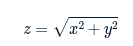

# Detect edges (2)

Detect edges (2)
Edge detection can be performed along multiple axes, then combined into a single edge value. For 2D images, the horizontal and vertical "edge maps" can be combined using the Pythagorean theorem:



One popular edge detector is the Sobel filter. The Sobel filter provides extra weight to the center pixels of the detector:

weights = [[ 1,  2,  1], 
           [ 0,  0,  0],
           [-1, -2, -1]]
For this exercise, improve upon your previous detection effort by merging the results of two Sobel-filtered images into a composite edge map.

Instructions
100 XP
Apply ndi.sobel() to im along the first and second axes.
Calculate the overall edge magnitude using the Pythagorean theorem. Use np.sqrt() and np.square().
Display the magnitude image. Use a grayscale colormap and set vmax to 75.

# Apply Sobel filter along both axes
sobel_ax0 = ndi.sobel(____, axis=____)
sobel_ax1 = ____

# Calculate edge magnitude 
edges = ____

# Plot edge magnitude
plt.imshow(____, ____, ____)
format_and_render_plot()

To combine the results of Sobel-filtered images into a single edge value, you can follow these instructions. The Sobel filter is applied along the two axes, and then the overall edge magnitude is computed using the Pythagorean theorem.

### Code Snippet

```python
# Apply Sobel filter along both axes
sobel_ax0 = ndi.sobel(im, axis=0)  # Sobel filter along the vertical axis
sobel_ax1 = ndi.sobel(im, axis=1)  # Sobel filter along the horizontal axis

# Calculate edge magnitude 
edges = np.sqrt(np.square(sobel_ax0) + np.square(sobel_ax1))  # Pythagorean theorem

# Plot edge magnitude
plt.imshow(edges, cmap='gray', vmax=75)  # Displaying in grayscale with a max value of 75
plt.colorbar()  # Adding a colorbar to indicate the intensity scale
format_and_render_plot()  # Render the plot
```

### Explanation

1. **Applying Sobel Filter:**
   - `sobel_ax0 = ndi.sobel(im, axis=0)`: This applies the Sobel filter to the image along the vertical axis (axis 0).
   - `sobel_ax1 = ndi.sobel(im, axis=1)`: This applies the Sobel filter along the horizontal axis (axis 1).

2. **Calculating Edge Magnitude:**
   - The edge magnitude is computed using:
     ```python
     edges = np.sqrt(np.square(sobel_ax0) + np.square(sobel_ax1))
     ```
   - This formula combines the responses from both axes into a single magnitude image, reflecting the overall intensity of edges in the image.

3. **Visualizing the Edge Magnitude:**
   - `plt.imshow(edges, cmap='gray', vmax=75)`: This line displays the edge magnitude image using a grayscale colormap, with a maximum intensity of 75 to enhance visibility of the edges.
   - `plt.colorbar()`: Adds a colorbar to the plot for reference on the intensity values.

4. **Rendering the Plot:**
   - Finally, `format_and_render_plot()` is called to render the subplot with the edge magnitude image.

### Conclusion
By following these steps, you will effectively combine the horizontal and vertical edge information into a composite edge map using the Sobel filter, enhancing the edge detection process in the image.