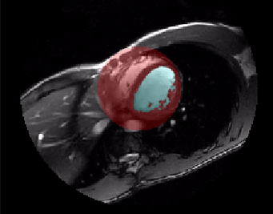

# Summarize the time series

Summarize the time series
The ejection fraction is the proportion of blood squeezed out of the left ventricle each heartbeat. To calculate it, radiologists have to identify the maximum volume (systolic volume) and the minimum volume (diastolic volume) of the ventricle.



Slice 4 of Cardiac Timeseries

For this exercise, create a time series of volume calculations. There are 20 time points in both vol_ts and labels. The data is ordered by (time, plane, row, col).

Instructions
100 XP
Initialize an empty array with 20 elements using np.zeros().
Calculate the volume of each image voxel. (Consult the meta dictionary for sampling rates.)
For each time point, count the pixels in labels, and update the time series array.
Plot the time series using plt.plot().

# Create an empty time series
ts = np.zeros(20)

# Calculate volume at each voxel
d0, d1, d2, d3 = vol_ts.meta['sampling']
dvoxel = d1 * d2 * d3

# Loop over the labeled arrays
for t in range(20):
    nvoxels = ndi.sum(1, labels[t], index=1)
    ts[t] = nvoxels * dvoxel

# Plot the data
plt.plot(ts)
format_and_render_plot()


Certainly! Let's break down the provided code step by step to explain its functionality and purpose in the context of analyzing the volume of a specified tissue structure (like the left ventricle) over a series of time points.

### Code Explanation

```python
# Create an empty time series
ts = np.zeros(20)
```
- **Purpose:** This line initializes an empty NumPy array named `ts` with 20 elements, all set to zero. 
- **Functionality:** The array `ts` will be used to store the volume of a specific labeled tissue (for instance, the left ventricle) at each of the 20 time points. 

```python
# Calculate volume at each voxel
d0, d1, d2, d3 = vol_ts.meta['sampling']
dvoxel = d1 * d2 * d3
```
- **Purpose:** This section calculates the volume of a single voxel (3D pixel) based on the sampling rates (the dimensions of each voxel in mm).
- **Functionality:**
  - `vol_ts.meta['sampling']` retrieves the sampling rates from the metadata of the volume data, which typically includes dimensions in the order of (depth, height, width) or (z, y, x). In this case, it assigns the sampling values to `d0`, `d1`, `d2`, and `d3` (though usually, only three dimensions are relevant for voxel volume).
  - `dvoxel = d1 * d2 * d3` calculates the volume of a single voxel by multiplying the dimensions. For example, if `d1`, `d2`, and `d3` are 1 mm, 1 mm, and 1 mm respectively, then the volume of each voxel will be \(1 \, \text{mm}^3\).

```python
# Loop over the labeled arrays
for t in range(20):
    nvoxels = ndi.sum(1, labels[t], index=1)
    ts[t] = nvoxels * dvoxel
```
- **Purpose:** This loop iterates through each of the 20 time points to calculate and record the volume of the labeled tissue at each time point.
- **Functionality:**
  - `for t in range(20):` sets up a loop that runs 20 times (once for each time point).
  - `nvoxels = ndi.sum(1, labels[t], index=1)` counts the number of voxels corresponding to a specific label (label 1) at the current time point `t`. 
    - Here, `labels[t]` refers to the labeled array for the time point `t`, and `index=1` specifies that you want to count voxels corresponding to label 1. 
    - The function `ndi.sum()` sums the values across the specified label, effectively counting how many voxels belong to that label.
  - `ts[t] = nvoxels * dvoxel` calculates the volume at the current time point by multiplying the number of voxels (`nvoxels`) by the voxel volume (`dvoxel`). This volume is then stored in the `ts` array at index `t`.

```python
# Plot the data
plt.plot(ts)
format_and_render_plot()
```
- **Purpose:** This part of the code visualizes the volume data over the 20 time points.
- **Functionality:**
  - `plt.plot(ts)` creates a line plot of the volumes stored in the `ts` array, showing how the volume of the labeled tissue changes over time.
  - `format_and_render_plot()` is presumably a custom function (not provided) that formats the plot (e.g., adding labels, a title, or adjusting aesthetics) and then renders it for display.

### Summary
1. **Initialization:** An empty time series array `ts` is created to store volume data for 20 time points.
2. **Voxel Volume Calculation:** The volume of a single voxel is computed based on its dimensions obtained from metadata.
3. **Volume Calculation Loop:** The loop counts the number of voxels corresponding to a specific label for each time point and updates the time series array with the calculated volume.
4. **Plotting:** Finally, the volume data is plotted to visualize changes over time.

This code is a typical approach in biomedical imaging analysis to quantify changes in tissue volume over time, which can provide valuable insights into the progression of diseases or the effects of treatments. If you have any further questions or need additional clarification, feel free to ask!