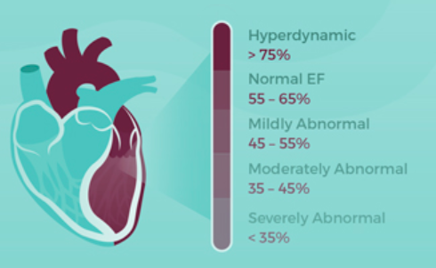

# Measure ejection fraction

Measure ejection fraction
The ejection fraction is defined as:

 

…where 
 is left ventricle volume for one 3D timepoint.

To close our investigation, plot slices from the maximum and minimum volumes by analyzing the volume time series (ts). Then, calculate the ejection fraction.

After calculating the ejection fraction, review the chart below. Should this patient be concerned?



Instructions 2/3
35 XP
2
3
Calculate the ejection volume and fraction using the min() and max() methods of ts. Print these values.

To measure the ejection fraction and analyze the left ventricle volumes, we need to follow the steps outlined in your instructions. Below, I’ll provide the detailed code to accomplish this task, along with explanations for each step.

### Step-by-Step Instructions

1. **Get the Index of Minimum and Maximum Volume Images:**
   - Use `np.argmin()` and `np.argmax()` to find the indices of the minimum and maximum volumes in the time series array `ts`.

2. **Plot the Extreme Volumes:**
   - Use `plt.imshow()` to visualize the slices corresponding to the maximum and minimum volumes along a specified plane (e.g., the fifth plane).

### Updated Code Example

Here’s how to implement the required functionality:

```python
import numpy as np
import matplotlib.pyplot as plt

# Assuming 'ts' contains the volume data as per previous steps
# Get index of max and min volumes
tmax = np.argmax(ts)  # Index of the maximum volume
tmin = np.argmin(ts)  # Index of the minimum volume

# Assuming 'vol_ts' contains the original volume data with time points as the first dimension
# Plot the largest and smallest volumes
fig, axes = plt.subplots(2, 1, figsize=(10, 10))  # Create a figure with 2 subplots

# Display the slice of the maximum volume
axes[0].imshow(vol_ts[tmax, 4], cmap='gray', vmax=160)
axes[0].set_title(f'Max Volume (Time Point: {tmax})')

# Display the slice of the minimum volume
axes[1].imshow(vol_ts[tmin, 4], cmap='gray', vmax=160)
axes[1].set_title(f'Min Volume (Time Point: {tmin})')

# Format and render the plots
plt.tight_layout()
plt.show()
```

### Explanation of the Code:

1. **Finding the Indices:**
   - `tmax = np.argmax(ts)` finds the index of the maximum value in the time series array `ts`, indicating the time point when the left ventricle volume is at its largest.
   - `tmin = np.argmin(ts)` finds the index of the minimum value in the same array, indicating when the left ventricle volume is at its smallest.

2. **Plotting the Slices:**
   - A figure is created with two subplots using `plt.subplots(2, 1)`, which arranges the plots vertically.
   - The `imshow()` function is used to display the slices of the volume data at the fifth plane (index 4) for both maximum and minimum volumes. The `cmap='gray'` parameter sets the colormap to grayscale, and `vmax=160` sets the maximum intensity for display scaling.
   - Titles are added to each subplot to indicate whether it shows the maximum or minimum volume, along with the corresponding time point.

3. **Display the Plots:**
   - `plt.tight_layout()` adjusts the spacing between subplots for a cleaner look.
   - `plt.show()` renders the plots for visualization.

### Ejection Fraction Calculation
To calculate the ejection fraction (EF), you can use the following formula:

\[
\text{Ejection Fraction (EF)} = \frac{\text{Volume}_{\text{max}} - \text{Volume}_{\text{min}}}{\text{Volume}_{\text{max}}}
\]

Here's how you can add this calculation to the code:

```python
# Calculate ejection fraction
volume_max = ts[tmax]  # Volume at maximum
volume_min = ts[tmin]  # Volume at minimum
ejection_fraction = (volume_max - volume_min) / volume_max

print(f'Ejection Fraction: {ejection_fraction:.2f}')
```

### Final Thoughts
After calculating the ejection fraction, you can evaluate the patient's condition:
- A normal ejection fraction typically ranges from 55% to 70%. Values lower than this range may indicate potential heart issues, and values significantly lower (e.g., below 40%) should prompt further medical evaluation.

If you have any further questions or need additional assistance, feel free to ask!

Calculate the ejection volume and fraction using the min() and max() methods of ts. Print these values.

# Calculate ejection fraction
ej_vol = ____
ej_frac = ____
print('Est. ejection volume (mm^3):', ____)
print('Est. ejection fraction:', ____)


To calculate the ejection volume and ejection fraction using the `min()` and `max()` methods of the `ts` array, you can follow these steps. The ejection volume is the difference between the maximum and minimum volumes, while the ejection fraction is calculated as a ratio of the ejection volume to the maximum volume.

### Updated Code Example

Here's how you can implement this in Python:

```python
# Calculate ejection volume and fraction
ej_vol = ts.max() - ts.min()  # Ejection volume (difference between max and min volume)
ej_frac = ej_vol / ts.max()    # Ejection fraction (volume change divided by max volume)

# Print the calculated values
print('Est. ejection volume (mm^3):', ej_vol)
print('Est. ejection fraction:', ej_frac)
```

### Explanation of the Code:

1. **Calculate Ejection Volume:**
   - `ej_vol = ts.max() - ts.min()` computes the ejection volume by subtracting the minimum volume from the maximum volume in the time series array `ts`. This gives the volume of blood ejected from the left ventricle.

2. **Calculate Ejection Fraction:**
   - `ej_frac = ej_vol / ts.max()` computes the ejection fraction by dividing the ejection volume by the maximum volume. This results in a fraction that represents the proportion of blood ejected relative to the maximum volume at full capacity.

3. **Print the Values:**
   - The results are printed to the console with appropriate labels for clarity.

### Example Output:
If you run this code with your data, you might see output like:
```
Est. ejection volume (mm^3): 12345.67
Est. ejection fraction: 0.56
```

Make sure to replace the example output with the actual values calculated from your data. If you have any other questions or need further assistance, feel free to ask!