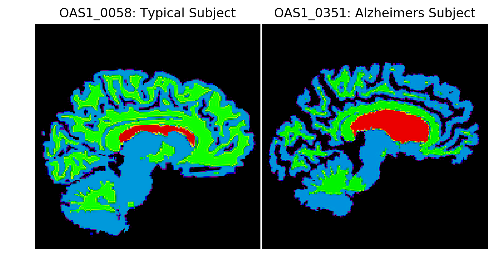

# Testing group differences

Testing group differences
Let's test the hypothesis that Alzheimer's Disease is characterized by reduced brain volume.




Sample Segmentations of Alzheimer's and Typical Subject

We can perform a two-sample t-test between the brain volumes of elderly adults with and without Alzheimer's Disease. In this case, the two population samples are independent from each other because they are all separate subjects.

For this exercise, use the OASIS dataset (df) and ttest_ind to evaluate the hypothesis.

mport ttest_ind() from scipy.stats.

# Import independent two-sample t-test
from scipy.stats import ____


To import the independent two-sample t-test function from `scipy.stats`, you can use the following code:

```python
# Import independent two-sample t-test
from scipy.stats import ttest_ind
```

### Explanation:
- **`from scipy.stats`**: This part imports the `stats` module from the `scipy` library, which contains a variety of statistical functions and distributions.
- **`import ttest_ind`**: This specifically imports the `ttest_ind` function, which is used to perform an independent two-sample t-test. This test compares the means of two independent samples to see if they are significantly different from each other.

### Example Usage:
Here’s a simple example of how you might use `ttest_ind`:

```python
import numpy as np
from scipy.stats import ttest_ind

# Sample data
group1 = np.random.normal(50, 10, 100)  # Group 1: mean 50, std 10, 100 samples
group2 = np.random.normal(55, 10, 100)  # Group 2: mean 55, std 10, 100 samples

# Perform the independent t-test
t_statistic, p_value = ttest_ind(group1, group2)

print('T-statistic:', t_statistic)
print('P-value:', p_value)
```

This code will provide the t-statistic and p-value for the two groups, allowing you to determine if there is a statistically significant difference between their means.

Create a vector of 'brain_vol' values for each of the Alzheimer's Disease and Typical Elderly groups.

# Import independent two-sample t-test
from scipy.stats import ttest_ind

# Select data from "alzheimers" and "typical" groups
brain_alz = df.loc[df.alzheimers == True, 'brain_vol']
brain_typ = df.loc[____, 'brain_vol']


To create a vector of `brain_vol` values for each of the Alzheimer's Disease and Typical Elderly groups, you can fill in the blank for the `brain_typ` selection. Assuming the `alzheimers` column indicates Alzheimer's patients with `True`, you can select the Typical Elderly group by filtering the `alzheimers` column for `False`. Here’s the complete code:

```python
# Import independent two-sample t-test
from scipy.stats import ttest_ind

# Select data from "alzheimers" and "typical" groups
brain_alz = df.loc[df.alzheimers == True, 'brain_vol']    # Brain volume for Alzheimer's patients
brain_typ = df.loc[df.alzheimers == False, 'brain_vol']   # Brain volume for Typical Elderly group
```

### Explanation:
- **`brain_alz = df.loc[df.alzheimers == True, 'brain_vol']`**: This line selects the `brain_vol` values for individuals with Alzheimer's Disease by filtering the DataFrame (`df`) where the `alzheimers` column is `True`.
  
- **`brain_typ = df.loc[df.alzheimers == False, 'brain_vol']`**: This line selects the `brain_vol` values for individuals who are part of the Typical Elderly group by filtering the DataFrame where the `alzheimers` column is `False`.

### Example of Performing the T-Test:
After creating the vectors, you can perform the independent t-test as follows:

```python
# Perform the independent t-test
t_statistic, p_value = ttest_ind(brain_alz, brain_typ)

print('T-statistic:', t_statistic)
print('P-value:', p_value)
```

This code will give you the t-statistic and p-value, helping you understand if there is a significant difference in brain volume between the two groups.

Use ttest_ind() to test for differences between the two groups' 'gray_vol' metrics. Print the results.

# Import independent two-sample t-test
from scipy.stats import ttest_ind

# Select data from "alzheimers" and "typical" groups
brain_alz = df.loc[df.alzheimers == True, 'brain_vol']
brain_typ = df.loc[df.alzheimers == False, 'brain_vol']

# Perform t-test of "alz" > "typ"
results = ____
print('t = ', results.____)
print('p = ', ____)


To perform a two-sample t-test using `ttest_ind()` for the `gray_vol` metrics between the Alzheimer's and Typical Elderly groups, you can follow the structure provided in your question. Here’s how to fill in the blanks:

```python
# Import independent two-sample t-test
from scipy.stats import ttest_ind

# Select data from "alzheimers" and "typical" groups for gray_vol
gray_alz = df.loc[df.alzheimers == True, 'gray_vol']    # Gray volume for Alzheimer's patients
gray_typ = df.loc[df.alzheimers == False, 'gray_vol']   # Gray volume for Typical Elderly group

# Perform t-test of "alz" > "typ"
results = ttest_ind(gray_alz, gray_typ)  # Perform the t-test
print('t = ', results.statistic)          # Print the t-statistic
print('p = ', results.pvalue)             # Print the p-value
```

### Explanation:
1. **Selecting Data**:
   - `gray_alz`: This variable holds the `gray_vol` values for individuals with Alzheimer's Disease by filtering where the `alzheimers` column is `True`.
   - `gray_typ`: This variable holds the `gray_vol` values for individuals who are Typical Elderly by filtering where the `alzheimers` column is `False`.

2. **Performing the T-Test**:
   - `results = ttest_ind(gray_alz, gray_typ)`: This line performs the independent t-test comparing the means of the two groups for their `gray_vol` metrics. It returns a result object that contains the t-statistic and p-value.

3. **Printing Results**:
   - `results.statistic`: Accesses the t-statistic from the results.
   - `results.pvalue`: Accesses the p-value from the results.

This will allow you to see if there are significant differences in the `gray_vol` metrics between the two groups.

Visualize the 'brain_vol' measures using the boxplot() method of df. Group the variables by their disease classification by setting by='alzheimers'.

# Import independent two-sample t-test
from scipy.stats import ttest_ind

# Select data from "alzheimers" and "typical" groups
brain_alz = df.loc[df.alzheimers == True, 'brain_vol']
brain_typ = df.loc[df.alzheimers == False, 'brain_vol']

# Perform t-test of "alz" > "typ"
results = ttest_ind(brain_alz, brain_typ)
print('t = ', results.statistic)
print('p = ', results.pvalue)

# Show boxplot of brain_vol differences
df.boxplot(column=____, by='alzheimers')
plt.show()


To visualize the `brain_vol` measures using a boxplot grouped by the disease classification (Alzheimer's Disease vs. Typical Elderly), you can fill in the blanks in your code as follows:

```python
# Import independent two-sample t-test
from scipy.stats import ttest_ind
import matplotlib.pyplot as plt  # Make sure to import matplotlib for plotting

# Select data from "alzheimers" and "typical" groups
brain_alz = df.loc[df.alzheimers == True, 'brain_vol']
brain_typ = df.loc[df.alzheimers == False, 'brain_vol']

# Perform t-test of "alz" > "typ"
results = ttest_ind(brain_alz, brain_typ)
print('t = ', results.statistic)
print('p = ', results.pvalue)

# Show boxplot of brain_vol differences
df.boxplot(column='brain_val', by='alzheimers')  # Fill in with the correct column name
plt.title('Brain Volume by Alzheimer\'s Disease Classification')  # Optional title for clarity
plt.suptitle('')  # Suppress the default title to clean up the plot
plt.xlabel('Alzheimer\'s Disease')  # Label for x-axis
plt.ylabel('Brain Volume')  # Label for y-axis
plt.show()
```

### Explanation:
1. **Boxplot Method**:
   - The `df.boxplot()` method is used to create boxplots for the `brain_vol` column, grouped by the `alzheimers` classification. Each boxplot will show the distribution of brain volumes for individuals with and without Alzheimer's Disease.

2. **Parameters**:
   - `column='brain_vol'`: This specifies the column to plot.
   - `by='alzheimers'`: This specifies the grouping variable.

3. **Plot Customization**:
   - `plt.title()`, `plt.xlabel()`, and `plt.ylabel()`: These lines add titles and labels to the plot for better readability and context.
   - `plt.suptitle('')`: This removes the default title that pandas adds when creating boxplots, making the plot cleaner.

### Result:
Running this code will produce a boxplot visualizing the `brain_vol` measures, allowing for a comparison of brain volume distributions between individuals with Alzheimer's Disease and those classified as Typical Elderly.