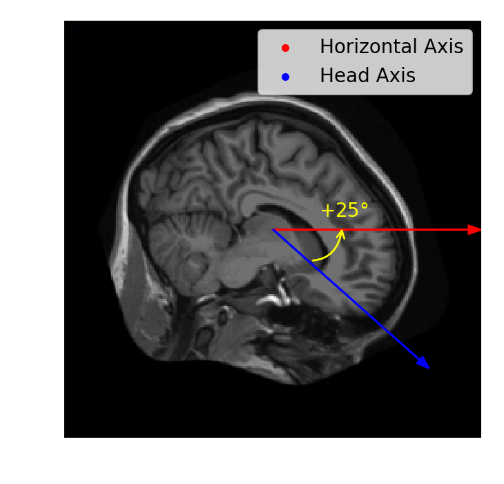

# Rotations

Rotations
In cases where an object is angled or flipped, the image can be rotated. Using ndi.rotate(), the image is rotated from its center by the specified degrees from the right horizontal axis.

For this exercise, shift and rotate the brain image (im) so that it is roughly level and "facing" the right side of the image.

Instructions
100 XP
Shift im towards the center: 20 pixels left and 20 pixels up.
Use ndi.rotate to turn xfm 30 degrees downward. Set reshape=False to prevent the image shape from changing.
Plot the original and transformed images.

# Shift the image towards the center
xfm = ____

# Rotate the shifted image
xfm = ndi.rotate(____, angle=____, reshape=____)

# Plot the original and rotated images
fig, axes = plt.subplots(2, 1)
axes[0].imshow(im)
____
format_and_render_plot()

explain "import imageio
import numpy as np
import scipy.ndimage as ndi
import matplotlib.pyplot as plt

# Assuming 'im' is your 2D brain image slice

# Shift the image towards the center: 20 pixels left and 20 pixels up
xfm = ndi.shift(im, shift=(-20, -20))

# Rotate the shifted image by -30 degrees to point it downwards
im_rotate = ndi.rotate(xfm, angle=-30, reshape=False)

# Create subplots (2 rows, 1 column)
fig, axes = plt.subplots(2, 1, figsize=(8, 8))

# Plot the original image on the first subplot
axes[0].imshow(im, cmap='gray')
axes[0].set_title('Original Image')

# Plot the rotated and shifted image on the second subplot
axes[1].imshow(im_rotate, cmap='gray')  # Use im_rotate here as per the hint
axes[1].set_title('Shifted and Rotated Image')

# Formatting and rendering the plot
plt.tight_layout()  # Adjust layout to prevent overlap
plt.show()
"