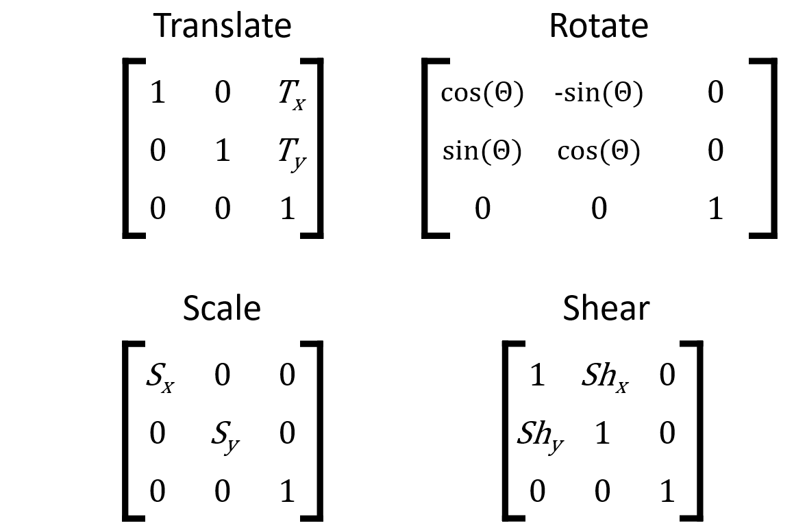

# Affine transform

An affine transformation matrix provides directions for up to four types of changes: translating, rotating, rescaling and shearing. The elements of the matrix map the coordinates from the input array to the output.



Encoded transformations within a matrix

For this exercise, use ndi.affine_transform() to apply the following registration matrices to im. Which one does the best job of centering, leveling and enlarging the original image?

Instructions
50 XP
Possible answers


[[1, 0, 0], [0, 1, 0], [0, 0, 1]]

[[1.5, -0.8, 60], [0.8, 1.5, -140], [0, 0, 1]]

[[1, -0.3, 60], [-0.3, 1, 60], [0, 0, 1]]

[[0.8, -0.4, 90], [0.4, 0.8, -6.0], [0, 0, 1]]

### Understanding Affine Transformations

An **affine transformation** matrix defines how an image should be transformed by specifying the following operations:
- **Translation** (shifting the image)
- **Rotation** (rotating the image)
- **Rescaling** (scaling up or down)
- **Shearing** (tilting or distorting the image)

The transformation matrix is typically a 3x3 matrix used to map the coordinates from the input to the output. The matrix is structured as follows:

\[
\begin{bmatrix}
a & b & t_x \\
c & d & t_y \\
0 & 0 & 1
\end{bmatrix}
\]

Where:
- **a, b, c, d** define the rotation, scaling, and shearing.
- **t_x, t_y** define the translation (shifts in x and y directions).

### Applying Affine Transformations with `ndi.affine_transform()`

You can apply an affine transformation using the `ndi.affine_transform()` function from the `scipy.ndimage` module. This function takes the transformation matrix and applies it to an image.

### Given Matrices and their Effects:

1. **Matrix 1:**
   ```python
   [[1, 0, 0], 
    [0, 1, 0], 
    [0, 0, 1]]
   ```
   - **Effect**: This is the identity matrix, meaning no transformation is applied. The image will remain unchanged.

2. **Matrix 2:**
   ```python
   [[1.5, -0.8, 60], 
    [0.8, 1.5, -140], 
    [0, 0, 1]]
   ```
   - **Effect**: 
     - **Scaling**: The values `1.5` along both diagonal elements indicate scaling up the image by 1.5x.
     - **Rotation/Shear**: The values `-0.8` and `0.8` introduce rotation and shear.
     - **Translation**: The values `60` and `-140` shift the image by 60 pixels in the x-direction and -140 pixels in the y-direction.

3. **Matrix 3:**
   ```python
   [[1, -0.3, 60], 
    [-0.3, 1, 60], 
    [0, 0, 1]]
   ```
   - **Effect**: 
     - **Rotation**: The values `-0.3` in the off-diagonal elements indicate a slight clockwise rotation.
     - **Translation**: The values `60` in both x and y directions shift the image by 60 pixels in both axes.
     - **Scaling**: The diagonal elements being `1` mean no scaling is applied.

4. **Matrix 4:**
   ```python
   [[0.8, -0.4, 90], 
    [0.4, 0.8, -6.0], 
    [0, 0, 1]]
   ```
   - **Effect**: 
     - **Scaling**: The values `0.8` indicate a slight reduction in size.
     - **Rotation**: The values `-0.4` and `0.4` indicate rotation (likely a counterclockwise rotation).
     - **Translation**: The values `90` and `-6.0` shift the image by 90 pixels in x and -6.0 pixels in y.

### Which Matrix Performs Best?

To determine which matrix best centers, levels, and enlarges the image, let's evaluate the transformations:

- **Matrix 1** does nothing to the image.
- **Matrix 2** applies strong scaling, rotation, and significant translation, likely causing distortion.
- **Matrix 3** applies a slight rotation and modest translation, which might center and level the image without significant distortion.
- **Matrix 4** reduces the size of the image and rotates it, but it also applies significant translation in the x-direction, which might misalign the centering.

### Conclusion:
The **third matrix** `[[1, -0.3, 60], [-0.3, 1, 60], [0, 0, 1]]` seems to be the best option because it:
- Applies modest translation and rotation to level the image.
- Leaves the scaling untouched, so the image remains the same size, avoiding distortion. 

You can test this by applying each matrix using `ndi.affine_transform()` and visualizing the results.


Fantastic. To implement matrix transformations in your workflow, you will likely want to use more advanced tools, such as those in scikit-image. The package's website has some nice tutorials. Also, note that 3D images require different size transformation matrices.