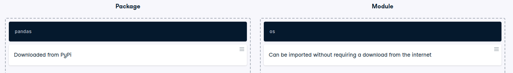

# Package or module?

Package or module?
Packages and modules are both integral parts of the Python ecosystem.

Can you identify the differences between the two of them?

Instructions
100XP
Place each item into the relevant section depending on whether it represents a package or a module.

