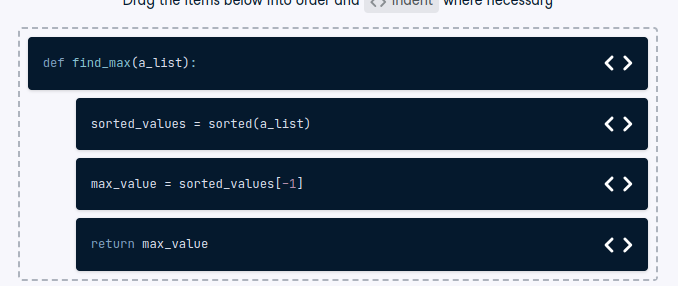

# Custom function syntax

Custom function syntax
Building a custom function requires following a repeatable process. Let's check your understanding of the syntax used to complete this task by creating a function to find the largest value in a list.

Instructions
100XP
Order and indent the code to create a function that sorts data and returns the largest value.

