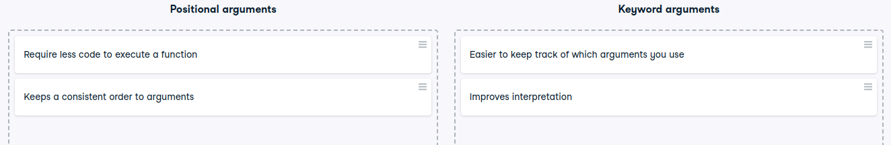

# Positional versus keyword arguments

Positional versus keyword arguments
In the video, you saw that functions can accept two different types of arguments: positional and keyword.

They both have their uses, but can you identify their distinct benefits?

Instructions
100XP
Place the statement into the appropriate benefit depending on whether it describes a benefit of positional or keyword arguments.

