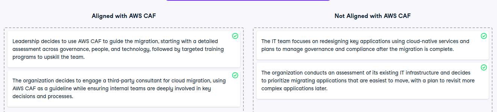

# Cloud adoption strategies with AWS CAF

Cloud adoption strategies with AWS CAF
Your organization is preparing for cloud migration, and it's essential to classify strategies based on their alignment with the AWS Cloud Adoption Framework (AWS CAF). Your task is to evaluate different approaches and determine which align with AWS CAF principles.

Instructions
100XP
You are presented with four different scenarios. Drag and drop each scenario into one of two buckets: "Aligned with AWS CAF" or "Not Aligned with AWS CAF."

