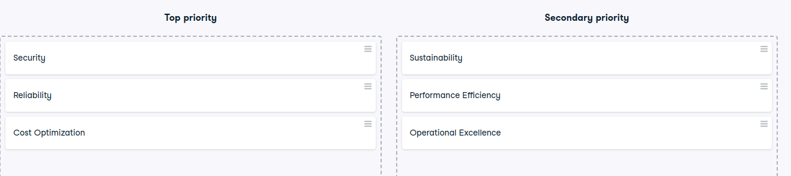

# Apply the Well-Architected Framework pillars

Apply the Well-Architected Framework pillars
Your company is planning to migrate a mission-critical application to AWS. The application must ensure data protection and compliance with regulations, maintain high availability, and optimize costs.

Instructions
100XP
Drag and drop each card into the correct bucket to demonstrate whether it's a top-priority, or secondary priority in this scenario.

