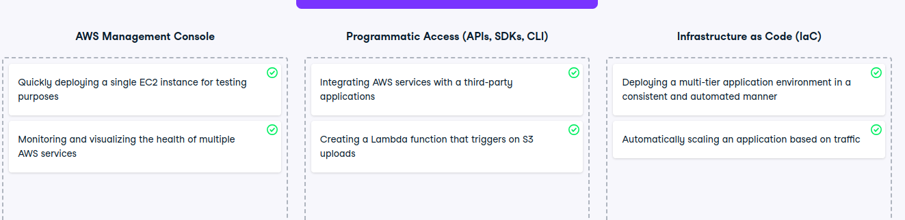

# Choose the best connectivity tool

Choose the best connectivity tool
You are a cloud architect at a company that is expanding its cloud infrastructure. Your team has been tasked with deploying, managing, and monitoring various AWS resources, ranging from EC2 instances to S3 buckets. However, with so many tools available—APIs, SDKs, the AWS Management Console, and Infrastructure as code (IaC)—your team needs to decide which tool to use for each specific task.

Great job! You've successfully matched the right AWS tools to the tasks at hand. This exercise highlights the importance of selecting the appropriate method for managing cloud resources, whether it's for quick manual tasks, automated programmatic control, or consistent infrastructure deployment using Infrastructure as Code. Keep these best practices in mind as you continue to build and manage robust cloud environments!