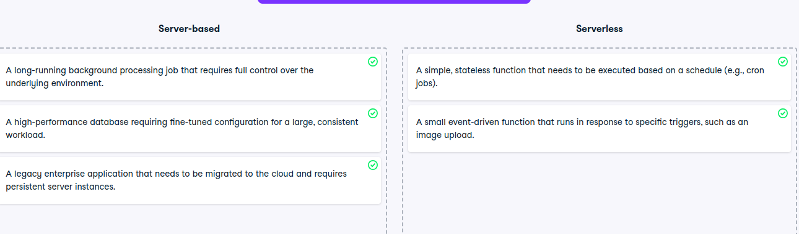

# Using server vs serverless solutions

Using server vs serverless solutions
You are a solutions architect tasked with optimizing the infrastructure for various workloads in a cloud environment. Your goal is to determine whether a server-based or serverless approach is best suited for each scenario. Understanding when to use a server-based architecture versus serverless architecture is crucial for balancing performance, scalability, and cost-efficiency.

