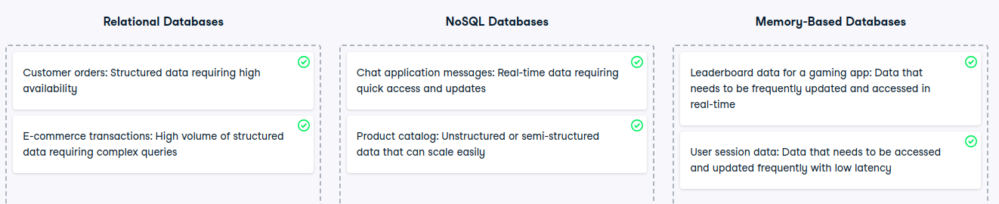

# A database use case

Exploring database options
In this exercise, you will explore different types of databases offered by AWS. Understanding when to use relational databases, NoSQL databases, and memory-based databases is crucial for efficiently managing and querying various types of data.

Your company needs to deploy a structured database for a new application. The database should be easy to manage and scale without worrying about the underlying infrastructure. Additionally, the application requires high availability and automatic backups. Which database solution should you choose?

Correct! Amazon RDS is a managed database service that handles all the infrastructure management, including scaling, backups, and high availability.

