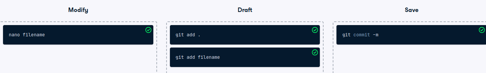

# The Git workflow

The Git workflow
You have now learned about the Git workflow along with key commands to use for each stage.

Can you match the commands to the zone reflecting the stage of the workflow they are used in?

Instructions
100XP
Drag the commands into the relevant zone.

