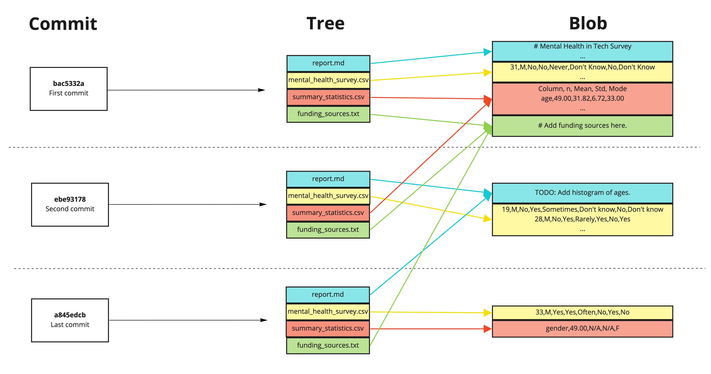

# Interpreting the commit structure

Interpreting the commit structure
The commit structure in Git is complex, but understanding how it works is essential for navigating storage and accessing specific versions of files.

The image displays three commits. What is the commit hash for the last updated version of report.md?

diagram of the commit, tree, and blob for three commits.jpg

Answer the question
50XP
Possible Answers
Select one answer

bac5332a
Press
1

a845edcb
Press
2

ebe93178 (X)
Press
3

Correct commit interpretation! Two other files were changed in the last commit, so the second commit represents the most recent version of report.md.

