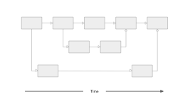

# Branching and merging

Branching and merging
Interpreting branches and merges is essential when working with Git.

In the diagram below, each box is a commit and the arrows point to the next commit. How many merges have taken place?

Branching and Merging

Answer the question
50XP
Possible Answers
Select one answer

None
Press
1

One
Press
2 (X)

Two
Press
3

Three
Press
4

Without a visual of the actual diagram, I’ll describe how to interpret the number of merges based on a typical branching structure in Git.

### How to Identify Merges:
- Each merge in Git typically brings together changes from one branch into another.
- A merge commit is created when two branches join back together, usually represented by a commit box with two arrows pointing to it.

### General Guidance:
1. **Identify commit nodes** with two or more arrows pointing to them—these represent merge commits.
2. **Count these merge commits**, as each represents one merge operation.

If you can describe the layout or the key points of the diagram (e.g., branches and where they join), I can provide a precise answer based on that.