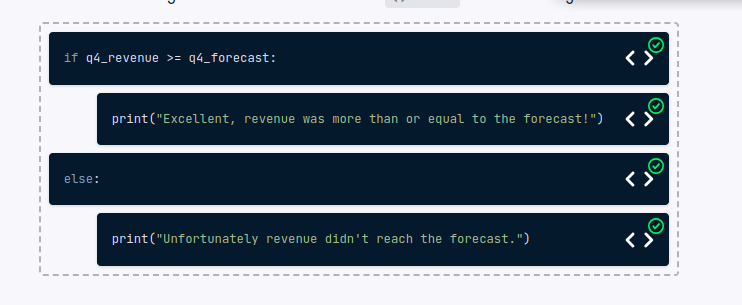

# Conditional statements

Conditional statements
Let's test your knowledge of building a custom workflow! You've been provided with the Q4 forecast and the actual revenue for LLM Camp. Your task is to check whether the revenue met or exceeded the forecast, printing appropriate statements depending on the results.

Here are the variables for reference.

q4_forecast = 259771

q4_revenue = 247835
You can drag each item up or down to reorder the code from top to bottom; and use the left/right arrows to indent each line of code.

Instructions
100XP
Sort and indent the lines of code to build a workflow that checks q4_forecast and q4_revenue, printing appropriate statements depending on whether revenue exceeded the forecast.

