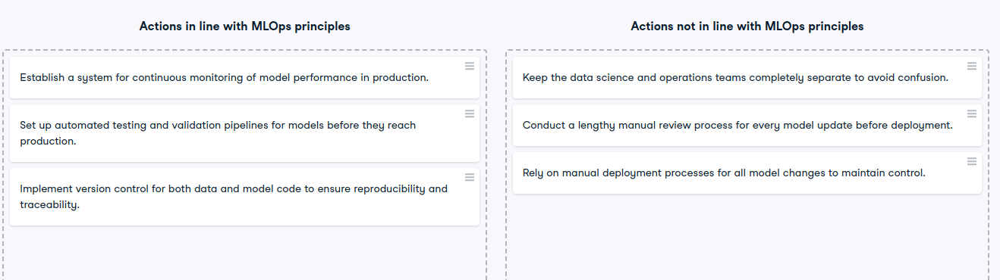

# MLOps principles

MLOps principles
As your team recognizes your growing expertise in MLOps, a senior colleague decides to challenge your knowledge. They present you with a mix of statements, some that align with MLOps principles and others that do not. Eager to demonstrate your understanding, you take on the challenge of categorizing these statements into those that are in line with MLOps and those that are not.

In this exercise, you will categorize statements into two buckets: one for statements that align with MLOps principles and another for statements that do not.

Instructions
100XP
Classify which action is in line with MLOps principles and which one is not.

