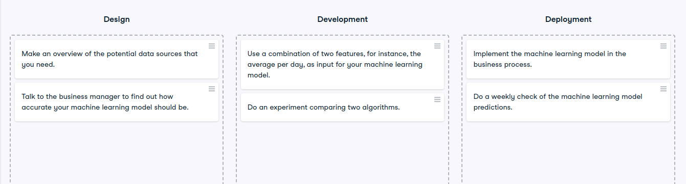

# Tasks per phase

Tasks per phase
In each phase, we can distinguish different tasks. Identifying the different tasks can help to see who is involved in that task, and what practices or tools we can apply to that task.

In this exercise, you will classify which tasks are part of which phase.

Instructions
100XP
Classify which task belongs to which phase.

