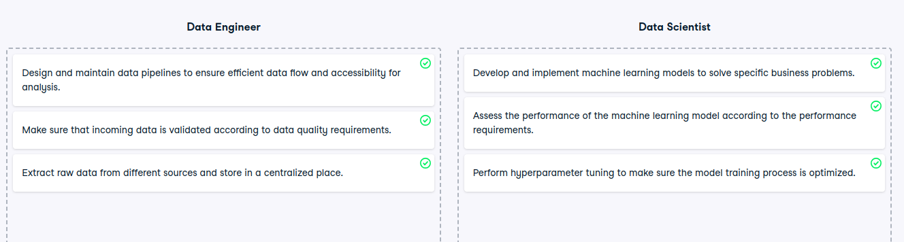

# Core roles in MLOps processes

Core roles in MLOps processes
You now know about the wide variety of roles that are involved in the machine learning lifecycle. Each role has its own responsibilities and, thus, relevance within the MLOps processes.

In this exercise, you will look at the three core roles involved. Let's see if you can distinguish who is responsible for which task.

Instructions
100XP
Decide which task belongs to which role.

