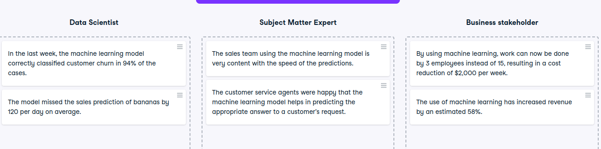

# Key metrics

Key metrics
Since machine learning projects require multidisciplinary effort, it is wise to align the different metrics that each of the roles involved in the project will track to determine success. This justifies and motivates the project throughout the machine learning lifecycle.

In this exercise, you will identify which metrics belong to which stakeholder.

Instructions
100XP
Categorize the metrics with the appropriate stakeholder.

