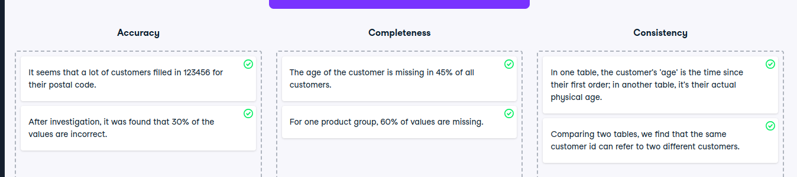

# Data quality dimensions

Data quality dimensions
To determine the quality of a dataset, it is quite valuable to investigate each data quality dimension individually. This helps to identify the dimensions where the data quality is sufficient and where it can be improved.

In this exercise, you'll classify the data issues into the data quality dimensions they belong to.
Instructions
100XP
Classify which data issue belongs to which data quality dimension: accuracy, completeness, or consistency.

