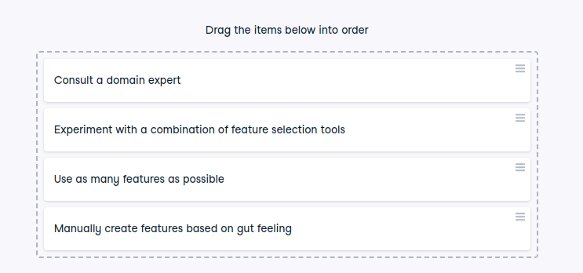

# Helping a friend

Helping a friend
Your friend, Alex, is a data scientist working on a machine learning project. He’s facing challenges with feature engineering and is unsure about the best approach to improve his model’s performance. You want to provide him with advice on how to proceed effectively.

Here are the four options Alex is considering:

Use as many features as possible: Alex is thinking of incorporating every feature available in his dataset, believing that more features will lead to better model performance.

Experiment with a combination of feature selection tools: Alex plans to apply various feature selection techniques, such as univariate selection, Principal Component Analysis (PCA), and Recursive Feature Elimination (RFE), to refine his feature set.

Consult a domain expert: Alex is considering reaching out to a domain expert who can provide insights into which features are most relevant and impactful for his specific problem.

Manually create features based on gut feeling: Alex is considering creating new features based on his intuition or gut feeling about what might be important, without a systematic approach.

Instructions
100XP
Rank the four options in order of effectiveness for improving Alex’s feature engineering process.

