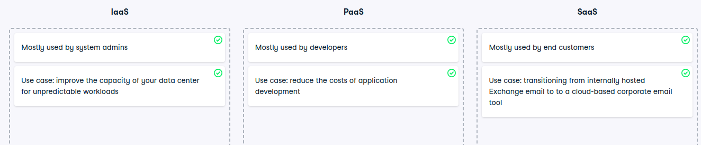

# IaaS, PaaS, or SaaS?

IaaS, PaaS, or SaaS?
You proved that you know what is offered in each of these service models, but it's also important to know when to use which one. They all have their own strengths and it is necessary to understand the differences among SaaS, PaaS, and IaaS to know how to best choose one for your organization.

Instructions
100XP
Classify each statement under the service model it describes best.

