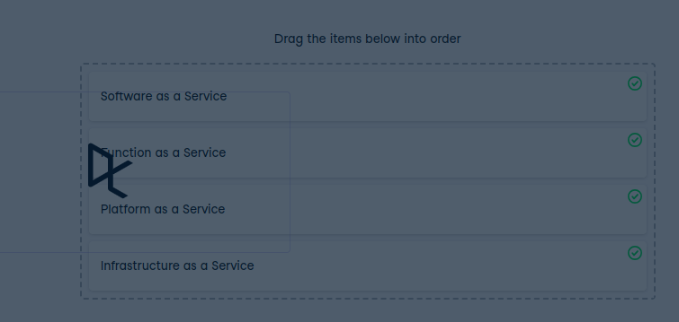

# Level of abstraction

Level of abstraction
Cloud service models can be ordered in terms of abstraction. Abstraction refers to the act of offering essential features without including the background details.

Let's take a look at the three models from before - IaaS, PaaS, and SaaS - as well as a fourth one, FaaS (Function as a Service). Can you order the cloud service models based on their level of abstraction? The model with the highest level of abstraction should come first.

Instructions
100XP
Order the cloud service models based on their level of abstraction. The highest level of abstraction should be at the top.

