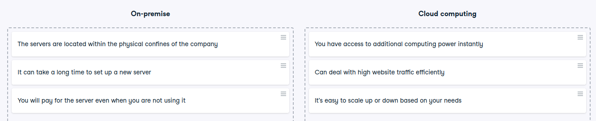

# Cloud vs. on-premise

Cloud vs. on-premise
The cloud is transforming the way organizations use computer services. Where in the past you had to own local servers and systems, in the cloud they are managed by an external provider that charges you for the use. Let's see if you know the difference.

Instructions
100XP
Arrange the statements based on the IT infrastructure model that it suits best.

