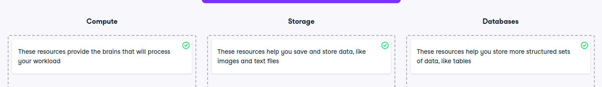

# Primary cloud services

Primary cloud services
Cloud providers like AWS, Microsoft Azure, and Google Cloud offer a wide variety of services. The three basic ones, which you will be able to find for every cloud provider, are:

Compute
Storage
Databases
It's important to understand what the resources provided by this service are responsible for.

Instructions
100XP
Match the description to the corresponding cloud service.

