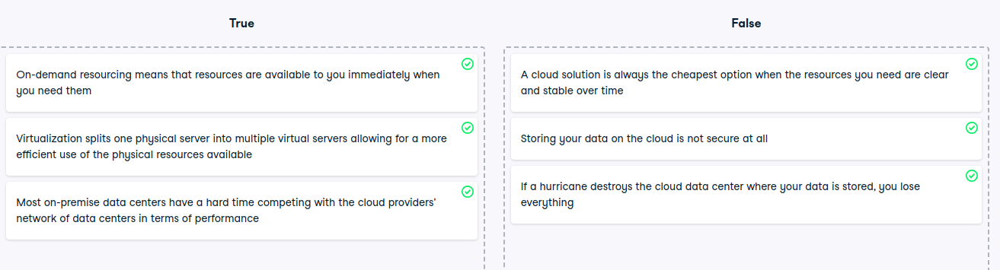

# Key characteristics

Key characteristics
Cloud computing services provide more possibilities for organizations all over the world. These services share certain characteristics that make them very powerful. Time to check how well you understand them!

Instructions
100XP
Identify the statements as true or false.

