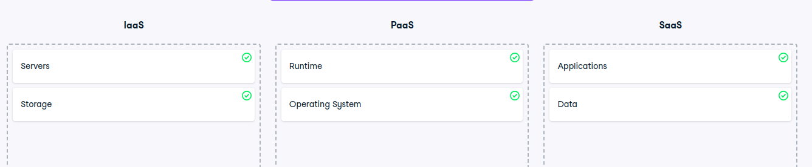

# Outsourcing IT services

Outsourcing IT services
Cloud computing is offered in three different service models each satisfying a unique set of business requirements. It's important to understand what each model offers. There are three main service models:

Infrastructure as a Service (IaaS) - offers cloud infrastructure
Platform as a Service (PaaS) - offers infrastructure and software for application development
Software as a Service (SaaS) - offers ready-to-use applications in the cloud
Instructions
100XP
For each feature, select the lowest-tier service model where the cloud provider manages that feature.

For example, for "Networking", the correct answer would be "IaaS". Networking is included in IaaS, PaaS, and SaaS, but IaaS is the lowest-tier service model.

