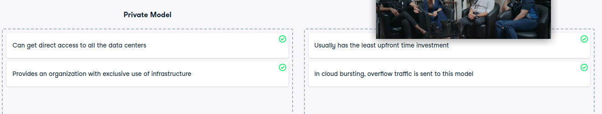

# Private or public?

Private or public?
In terms of cloud deployment models, the private model and the public model are on the opposite ends of the spectrum. Therefore, it's crucial to understand the difference between the two. If you know the strengths and drawbacks of each, then you can better decide on the best deployment model for a given use-case, even if it's something in between like the hybrid, community, or multicloud model!

Instructions
100XP
Classify the statements into the model that it best describes.

