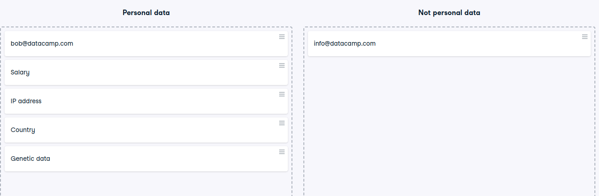

# Personal data
Personal data
In the video, we saw a list of data protection regulations around the world. To understand these regulations properly, you need to understand personal data. As a reminder, this is how GDPR defines personal data:

Personal data is any information that relates to an identified or identifiable living individual. Different pieces of information, which collected together can lead to the identification of a particular person, also constitute personal data. (Source)

