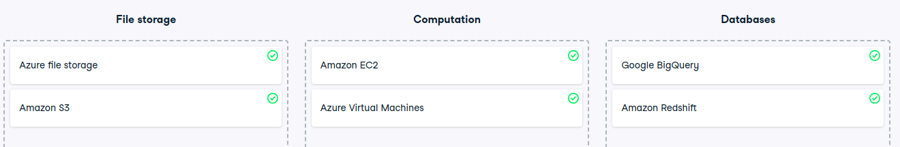

# Cloud providers and their services

Cloud providers and their services
Throughout this chapter, you looked into the cloud infrastructure services offered by Amazon, Microsoft, and Google.

Let's see how well you understand their respective solutions.

Instructions
100XP
Classify the services as file storage, computation or databases solutions.

